# **BreakTheMod**

## **Description**

*BreakTheMod* enhances Minecraft by adding a select few commands from BreakTheBot, and a few new ones, like whereIs and
nearby.

---

## **Features**

- WhereIs: It tells you where a player is based on the map api.
- Nearby: It tells you where players are in the rendered chunks, if they would be visible on the map ofcourse
- Locate: It tells you where a town or nation is
- GoTo: Tells you in which town to spawn in so you are the closest to the town you want to go to
- onlineStaff: It tells you all online staff
- townless: It gives you all online townless users
- coords: It gives you information about coordinates
- discordLinked: It tells you if a user has linked their discord account to their emc account and if yes gives you the
  link to their discord account
- Player Radar: shows players nearby, completely legal based on /nearby

---

## **Screenshots**

### **WhereIs**

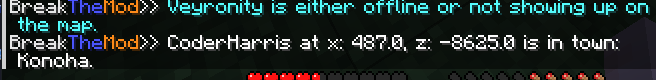
*Shows the location of a specific player.*

### **Nearby**

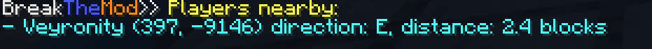
*Displays players nearby in rendered chunks.*
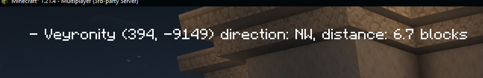
*Displays players nearby in rendered chunks in the hud*

### **Locate**

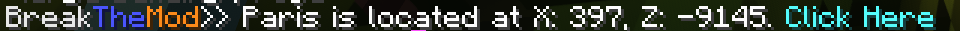
*Finds a town or nation’s location.*

### **GoTo**

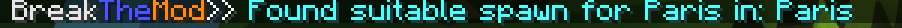
*Suggests the best spawn point to get closest to a town.*

### **onlineStaff**

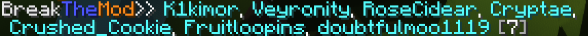
*Lists all online staff.*

### **townless**

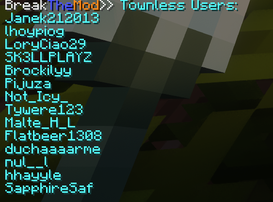
*Displays all online townless players.*

### **coords**

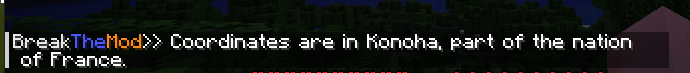
*Provides information about specific coordinates.*

### **discordLinked**

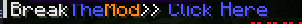
*Tells if a user’s Discord account is linked, with a link if available.*

### **calculateGold**

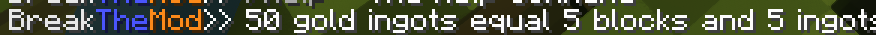
*Returns how many blocks the ingots are*

### **calculateStacks**

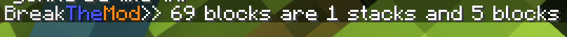
*Tells you the amount of stacks.*

## **Installation**

[BreakTheMod](/breakthemod.jar)

### **Requirements**

- Minecraft version: `1.21.8`
- Mod loader: `Fabric`
- dependencies:
    - `Fabric-API`
    - `ModMenu`
    - `ClothConfig`
    - `Fabric Language Kotlin`
  
### **Steps**

1. Download the mod from [Modrinth](https://modrinth.com/mod/breakthemod/).
2. Install Fabric (if not already installed).
3. Make sure fabric language kotlin is installed.
4. Place the mod `.jar` file in the `mods` folder of your Minecraft directory.
5. You are gonna need clothconfig2 >=13.0.138 and modmenu >=9.2.0
6. Launch Minecraft and enjoy!

---

## **Compatibility**

- Compatible with Minecraft versions: `>=1.21.4`

---

## **Contributing**

> Contributions are welcome! Please follow these steps:
> 1. Fork the repository.
> 2. Make your changes in a feature branch.
> 3. Submit a pull request.

Review [CONTRIBUTING.md](/CONTRIBUTING.md) for more details.

---

## **Credits**

> - Developed by charis_k
> - Special thanks to Veyronity

---

## **License**

> This mod is licensed under the [GPLV3](./LICENSE).  
> Feel free to use, modify, and distribute it under the terms of this license.

---

## **Links**

- [Download](https://modrinth.com/mod/breakthemod/)
- [Discord Server](https://discord.gg/RVkwSrPyuq)

---

## **Previous builds**

| Path                                      | Checksum                                            |
|-------------------------------------------|-----------------------------------------------------|
| [1.4](builds/1.4/breakthemod-1.4.jar)     | [Checksum](builds/1.4/breakthemod-1.4.jar.sha256)   |
| [1.4.1](builds/1.4/breakthemod-1.4.1.jar) | [Checksum](builds/1.4/breakthemod-1.4.1.jar.sha256) |
