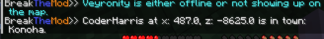
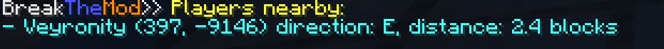
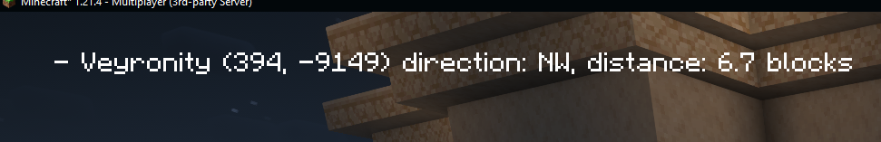
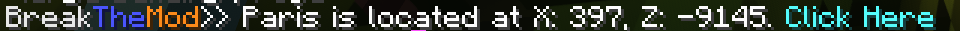
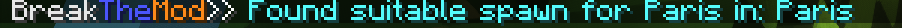
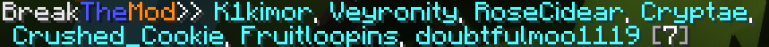
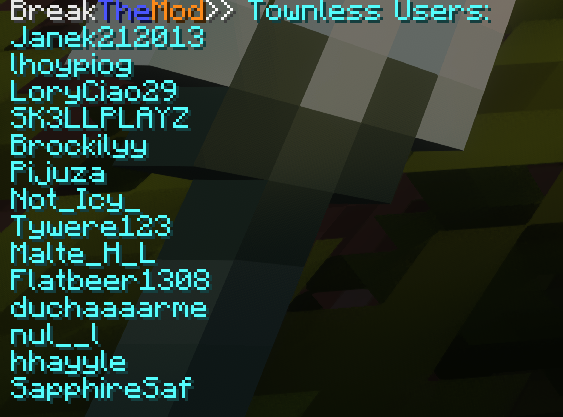
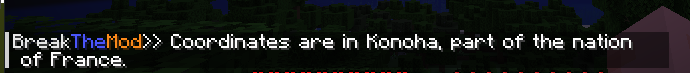
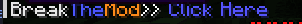
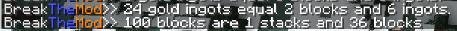

# **BreakTheMod**

## **Description**

*BreakTheMod* enhances Minecraft by adding a select few commands from BreakTheBot, and a few new ones, like whereIs and
nearby.

---

# ***Features***

### Commands:
  * Calculate: Helps with the conversions of blocks & stacks.
  * DiscordId: Tells you the discord username of a player if they have linked their account
  * FindPlayer: Show where a player is based on the map api.
  * Goto: Shows you the nearest spawnable town of the town you selected.
  * Help: Displays a help message.
  * LastSeen: Displays the last time a user was online
  * Locate: Gives you the coordinates of a town/nation
  * Nearby: Shows all the nearby players (legal).
  * OnlineStaff: Shows online staff.
  * Townless: Shows all the online townless players.

### Widgets:
  * NearbyPlayers: A widget version of the nearby command.
  * NearbyTowns: Displays the 3 closest towns  in a 500 block range.
  * MiningWidget: Displays how much gold you have mined in this trip.

### Features: 
  * AutoHUD: Enables the hud of choice of the user.
  * Player Affiliations: Displays the users town and nation under their name.
  * Channel Preview: Displays the current channel the user is in, in the chat bar.
  * Experience Text: Displays the amount of experience next to the users level.
  * ShopTracker: Tracks which of your shops have run out and sends you a message when you are back.

---

## **Screenshots**

### **WhereIs**

*Shows the location of a specific player.*

### **Nearby**

*Displays players nearby in rendered chunks.*

*Displays players nearby in rendered chunks in the hud*

### **Locate**

*Finds a town or nation’s location.*

### **GoTo**

*Suggests the best spawn point to get closest to a town.*

### **onlineStaff**

*Lists all online staff.*

### **townless**

*Displays all online townless players.*

### **coords**

*Provides information about specific coordinates.*

### **discordLinked**

*Tells if a user’s Discord account is linked, with a link if available.*

### ***calculate***

*Helps with the conversions of stacks & blocks.*

## **Installation**

[BreakTheMod](builds/1.4/breakthemod-1.4.1.jar)

### **Requirements**

- Minecraft version: `1.21.11`
- Mod loader: `Fabric`
- dependencies:
    - `Fabric-API`
    - `ModMenu`
    - `ClothConfig`
    - `Fabric Language Kotlin`
  
### **Steps**

1. Download the mod from [Modrinth](https://modrinth.com/mod/breakthemod/).
2. Install Fabric (if not already installed).
3. Make sure fabric language kotlin is installed.
4. Place the mod `.jar` file in the `mods` folder of your Minecraft directory.
5. You are gonna need clothconfig2>=21.11.153, modmenu>=17.0.0-beta.2.
6. Launch Minecraft and enjoy!

---

### **How to build**
1. Copy the repo by doing `git clone https://github.com/breakthebot/BreakTheMod.git`
2. Do `gradle build -Prelease`
3. And you're done, select the breakthemod-ver.jar.
---

## **Compatibility**

- Compatible with Minecraft versions: `>=1.21.11`

---

## **Contributing**
* If you plan to contribute please read TODO.md.
> Contributions are welcome! Please follow these steps:
> 1. Fork the repository.
> 2. Make your changes in a feature branch.
> 3. Submit a pull request.

Review [CONTRIBUTING.md](/CONTRIBUTING.md) for more details.

---

## **Credits**

> - Developed by charis_k
> - Special thanks to Veyronity

---

## **License**

> This mod is licensed under the [GPLV3](./LICENSE.txt).  
> Feel free to use, modify, and distribute it under the terms of this license.

---

## **Links**

- [Download](https://modrinth.com/mod/breakthemod/)
- [Discord Server](https://discord.gg/RVkwSrPyuq)

---
